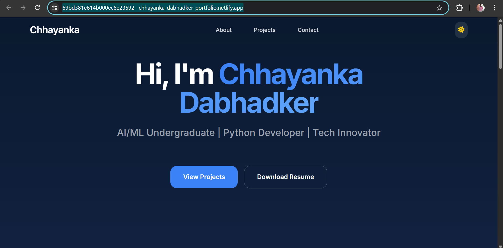

# 🌐 Chhayanka Dabhadker – Portfolio

A modern and responsive personal portfolio website showcasing my projects, skills, and experience.

---

## 🚀 Live Website

🔗 https://69bd381e614b000ec6e23592--chhayanka-dabhadker-portfolio.netlify.app/

---

## 📌 Features

* 💻 Responsive design (mobile-friendly)
* 🎨 Modern UI with smooth animations
* 🧠 Projects section with images
* 📄 Resume download/view option
* 🔗 Social media integration

---

## 🛠️ Tech Stack

* HTML5
* CSS3
* JavaScript

---

## 📂 Projects Included

### 🚁 Drone Monitoring System

Drone-based surveillance and smart monitoring system.

### 🌾 Adarsh Gram Project

Smart village infrastructure using technology.

### 🥽 AR/VR Experience

Immersive augmented and virtual reality system.

---

## 📬 Contact

* GitHub: https://github.com/chhayanka17
* LinkedIn: https://www.linkedin.com/in/chhayanka-dabhadker-b86ab331a

## 📸 Preview

---

⭐ If you like this project, feel free to star the repo!
